# Project Manager App

## Table of Contents
1. [Introduction](#introduction)
2. [Prerequisites](#prerequisites)
3. [Backend Setup](#backend-setup)
    - [Python Environment](#python-environment)
    - [Database Configuration](#database-configuration)
    - [Redis Configuration](#redis-configuration)
    - [Django Configuration](#django-configuration)
4. [Frontend Setup](#frontend-setup)
5. [Running the Application](#running-the-application)
6. [Testing](#testing)
7. [Troubleshooting](#troubleshooting)
8. [TODO](#todo)
9. [Contributing](#contributing)
10. [License](#license)

## Introduction

This project is a comprehensive project management mobile application featuring a Flutter frontend and a Django REST Framework backend with following features:
- Secure user authentication (JWT-based)
- User management
- Interactive projects & tasks management 
- Kanban-style task board
- Real-time chat functionality with WebSocket support for collaboration
- Responsive design for multi-platform support

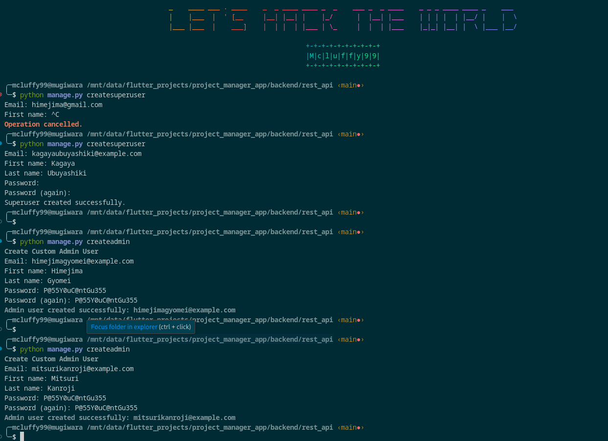
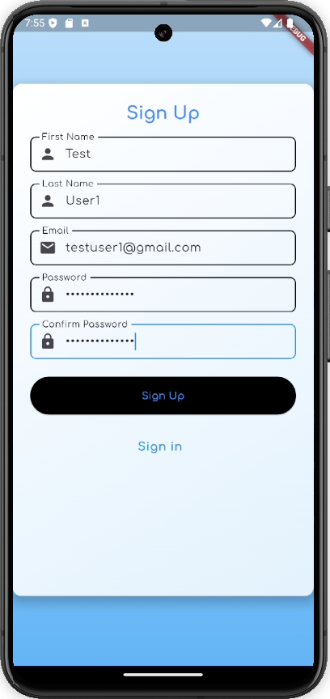 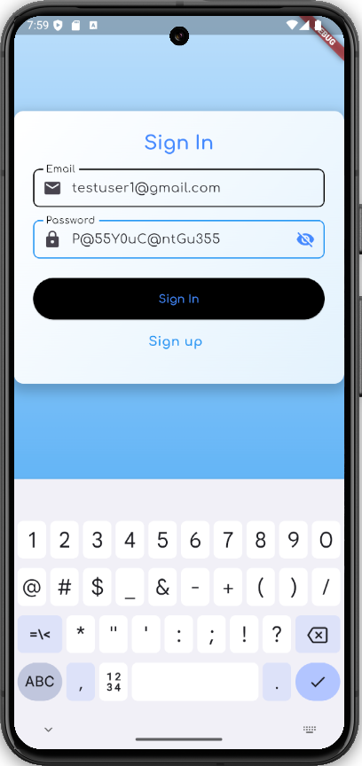 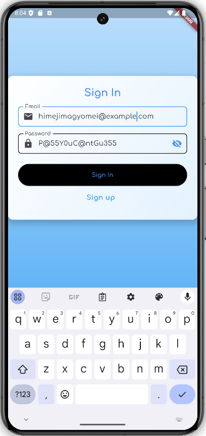
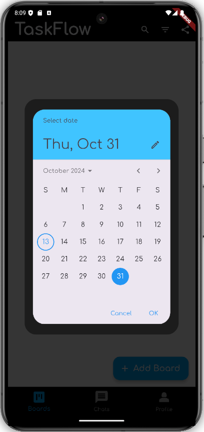 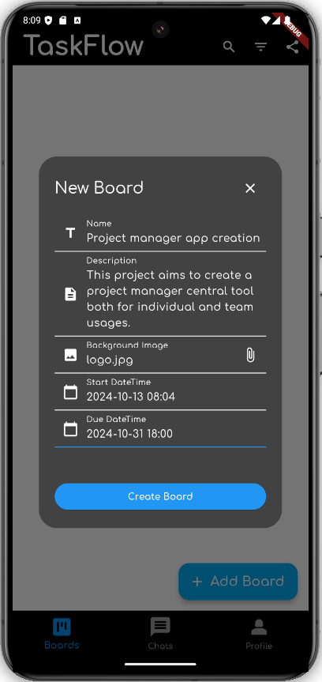 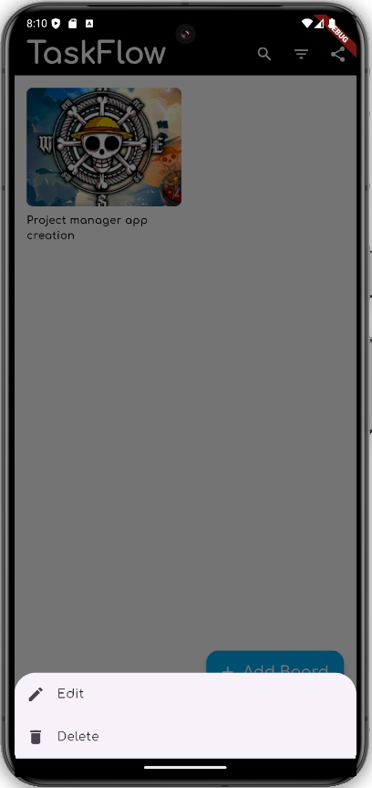
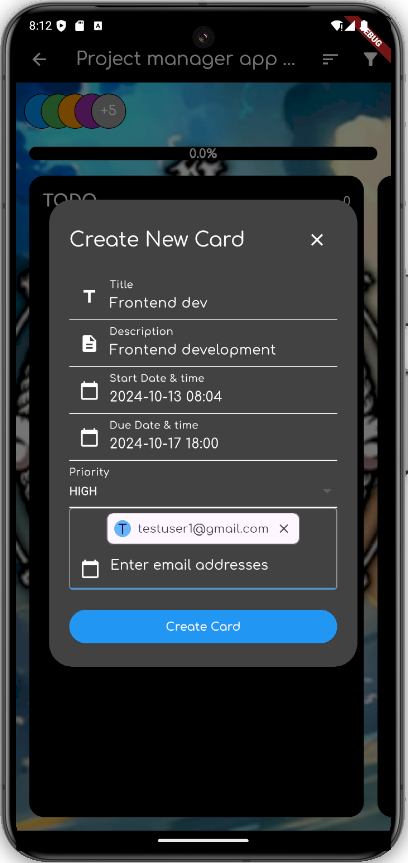 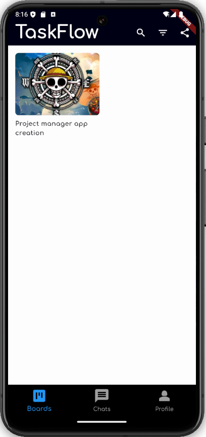 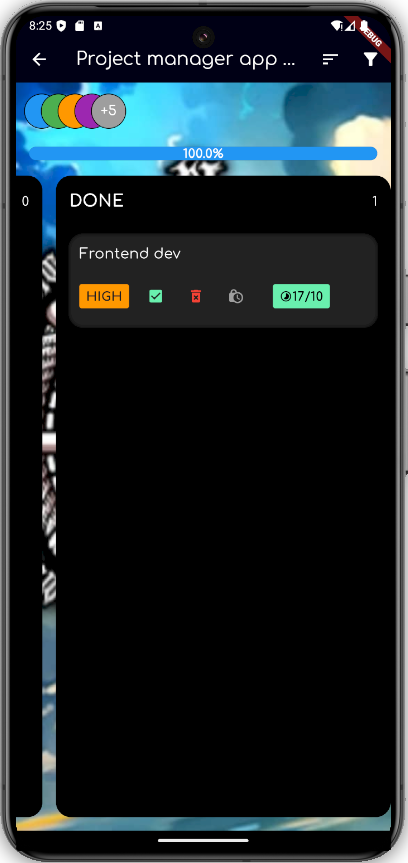
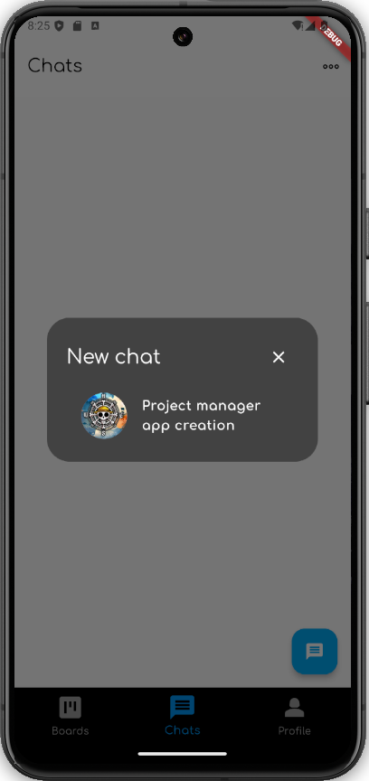 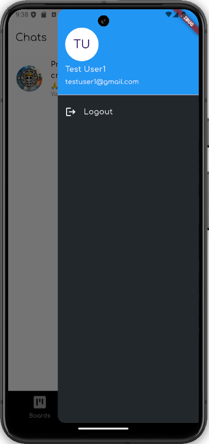 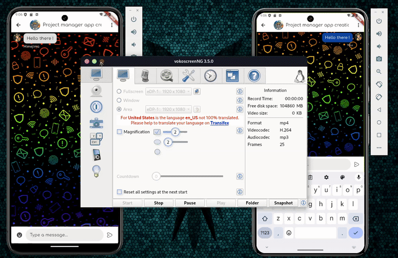


## Prerequisites

Ensure you have the following installed on your system:

- Python 3.11.2 or higher
- Flutter 3.24.3 or higher with at least android and another platform
- Mariadb 15.1 or higher
- Redis 7.0.15 or higher

## Backend Setup

### Python Environment

1. Navigate to the backend directory:
   ```bash
   cd backend/rest_api
   ```

2. Create and activate a virtual environment:
   ```bash
   python -m venv venv
   source venv/bin/activate  # On Windows use `venv\Scripts\activate`
   ```

3. Install the required Python packages:
   ```bash
   pip install -r requirements.txt
   ```


### Database Configuration

1. Install MySQL and create a new database:
   ```sql
   CREATE DATABASE project_manager_app_db CHARACTER SET utf8mb4 COLLATE utf8mb4_unicode_ci;
   ```
2. Create user and grant all privileges to database for him.

3. Update the `DATABASES` configuration in `rest_api/settings.py`:
   ```python
   DATABASES = {
       'default': {
           'ENGINE': 'django.db.backends.mysql',
           'NAME': 'project_manager_app_db',
           'USER': 'your_mysql_username',
           'PASSWORD': 'your_mysql_password',
           'HOST': 'localhost',
           'PORT': '3306',
           'OPTIONS': {'charset': 'utf8mb4'},
       }
   }
   ```

### Redis Configuration

1. Install and start Redis:
   ```bash
   sudo apt-get install redis-server  # For Ubuntu/Debian
   sudo systemctl start redis-server.service
   ```

2. Ensure Redis is running on `localhost:6379`. If using a different configuration, update the `CHANNEL_LAYERS` in `settings.py`:
   ```python
   CHANNEL_LAYERS = {
      'default': {
          'BACKEND': 'channels_redis.core.RedisChannelLayer',
          'CONFIG': {
              "hosts": [('127.0.0.1', 6379)],
          },
      },
   }
   ```

### Django Configuration

1. Apply database migrations:
   ```bash
   python manage.py migrate
   ```

2. Create admin users:
   ```bash
   python manage.py createadmin
   ```

3. Create a superuser for API admin site access:
   ```bash
   python manage.py createsuperuser
   ```


## Frontend Setup

1. Navigate to the project root directory.

2. Install Flutter dependencies:
   ```bash
   flutter pub get
   ```

3. If you encounter any issues with package versions, update `pubspec.yaml` and run `flutter pub upgrade`.

## Running the Application

### Backend

1. Start the Django development server:
   ```bash
   python manage.py runserver
   ```

   The server will start on `http://127.0.0.1:8000`.

2. For production, use a production-grade server like Gunicorn with Nginx and start server on wanted interface

### Frontend

1. If running backend server on interface different from loopback, change Api and Websocket URLs in lib/services/api.dart and /lib/services/websocket.dart

2. Create 2 different android emulators

3. Start emulators
   - `flutter emulators --launch <emulator 1 id>`
   - `flutter emulators --launch <emulator 2 id>`

4. Run the Flutter application:
   ```bash
   flutter run -d all
   ```
   

## Testing

### Unit Tests

1. Backend:
   ```bash
   python manage.py test
   ```

### Task Management Testing
1. Build the app on and android platform.
2. Log in with an admin account.
3. Test board creation, update and deletion features. Update and delete features are available when long pressing on a board.
4. Tap on a board to see all related tasks.
5. Test card operations (creation, update, deletion). User added to a card can see it and also the board which then appears in available chat group list.
6. Log out and sign in to a non admin account previously added to card members.
7. Test marking card as finished or blocked/unblocked  

### Chat Feature Testing

1. Build the app on two separate devices (e.g., Android device and Linux desktop).
2. Ensure both devices are connected to the same network as the backend server.
3. Log in with different user accounts on each device.
4. Navigate to the chat feature and start a conversation.


## TODO

- Enhance UI
- Add Dark/Light theme schema
- Add calendar part (day or today and week views) 
- Add animation when task is finished
- Add a reward system when task is finished before due date
- Add workspace (own and invited). Users are admin in their own workspace and simple user for the ones they are invited in.
- Add events part
- Add settings 
- Add OTP for mail confirmation
- Add call, meeting, voice notes, delivered and read receipts, screen share, file and images messages, stickers.
- Add private chat with single user of any board or workspace.
- Add Gantt view for workspace admin.
- Add intelligent push notification system (alarm, dialog) to make users finish tasks efficiently
- Add AI to generate content and help in project tasks.
- Add Settings
- Add local database to make tasks available offline.
- Add profile editing.
- Social network authentication.
- Biometric authentication.
- Security controls
- Project accounting management.
- Add others platforms and enhance responsive
- Password reinitialization feature
- Lost internet connection.
- Integrate other existing tools (canvas like, google docs, etc.)
- Message deletion and edition
- Message encryption.
- Intelligent progress monitoring.
- Tests & Deployment.
- Real-time even in sleep mode.
- Notification when new task assigned.
- Cards members displayed for each car; same for board and workspaces members.
- Restructuring the source code.
- Timer for focus mode.
- Daily life tasks integration in own workspace.
- Subscription modules / changing license constraints.


## Troubleshooting

- If updates or messages not rel time, logout and try again.
- If you encounter CORS issues, ensure the frontend URL is added to `CORS_ALLOWED_ORIGINS` in `settings.py`.
- For WebSocket connection problems, check if Daphne is running and the WebSocket URL is correct in the frontend code.
- Database connection issues: Verify MySQL service is running and credentials are correct.

## Contributing

Please read [CONTRIBUTING.md](CONTRIBUTING.md) for details on our code of conduct and the process for submitting pull requests.

## License

This project is licensed under the MIT License - see the [LICENSE.md](LICENSE.md) file for details.